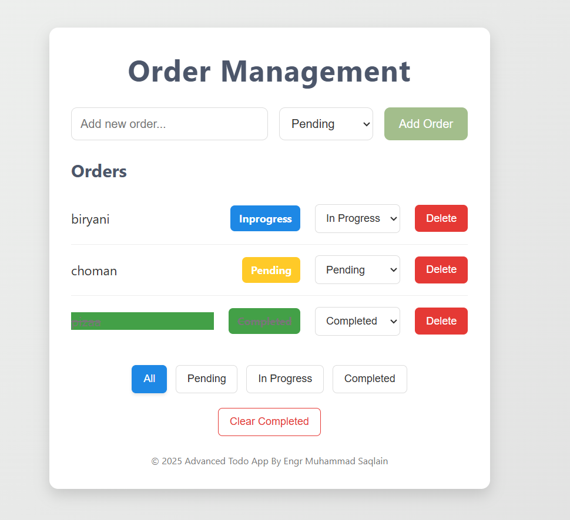

# Simple Todo App (HTML, CSS, JavaScript)

This is a basic todo application built using HTML for the structure, CSS for styling, and JavaScript for interactive functionality. Users can add tasks, mark them as completed, change their status (Pending, In Progress, Completed), filter tasks by status, and delete tasks. There's also an option to clear all completed tasks.

## Features

* **Add Tasks:** Enter a task description and select a status to add it to the todo list.
* **View Tasks:** Displays a list of all added tasks with their descriptions and current status.
* **Change Status:** Update the status of a task using a dropdown select (Pending, In Progress, Completed).
* **Mark as Completed:** Completed tasks are visually indicated with a strikethrough.
* **Delete Tasks:** Remove individual tasks from the list.
* **Filter Tasks:** View tasks based on their status (All, Pending, In Progress, Completed).
* **Clear Completed:** Remove all tasks that are marked as "Completed".

## Technologies Used

* HTML5
* CSS3
* JavaScript (ES6)

## How to Use

1.  Clone or download the repository to your local machine.
2.  Open the `index.html` file in your web browser.
3.  **Adding Tasks:**
    * Enter the description of your new task in the input field.
    * Select the initial status of the task from the dropdown (optional, defaults to Pending).
    * Click the "Add Task" button.
4.  **Managing Tasks:**
    * **Status:** Use the dropdown next to each task to change its status.
    * **Completed:** Tasks marked as "Completed" will have a strikethrough.
    * **Delete:** Click the red "Delete" button next to a task to remove it.
5.  **Filtering Tasks:**
    * Use the buttons at the bottom ("All", "Pending", "In Progress", "Completed") to filter the displayed tasks based on their status.
6.  **Clearing Completed Tasks:**
    * Click the "Clear Completed Tasks" button to remove all tasks that have been marked as "Completed".

## Output Screenshot

*(Make sure you have a file named `output.PNG` in the same directory as your `README.md` file for the image to display correctly.)*

## Project Structure

.
├── index.html
├── script.js    <-- Your JavaScript file (likely named this)
├── style.css     <-- Your CSS file (likely named this)
└── output.PNG    <-- Output screenshot
└── README.md

* `index.html`: The main HTML file containing the structure of the todo app.
* `script.js`: The JavaScript file containing the application's logic and interactivity.
* `style.css`: The CSS file containing the styling for the todo app.
* `output.PNG`: A screenshot showcasing the visual output of the todo app.
* `README.md`: This file, providing a description of the project.

## Further Improvements (Optional)

* Implement local storage to persist tasks even after the browser is closed.
* Add editing functionality for existing tasks.
* Implement drag-and-drop to reorder tasks.
* Improve the visual design and responsiveness for different screen sizes.
* Add user authentication or multiple user support (for more complex applications).

## Author

[https://github.com/msaqlain143]
